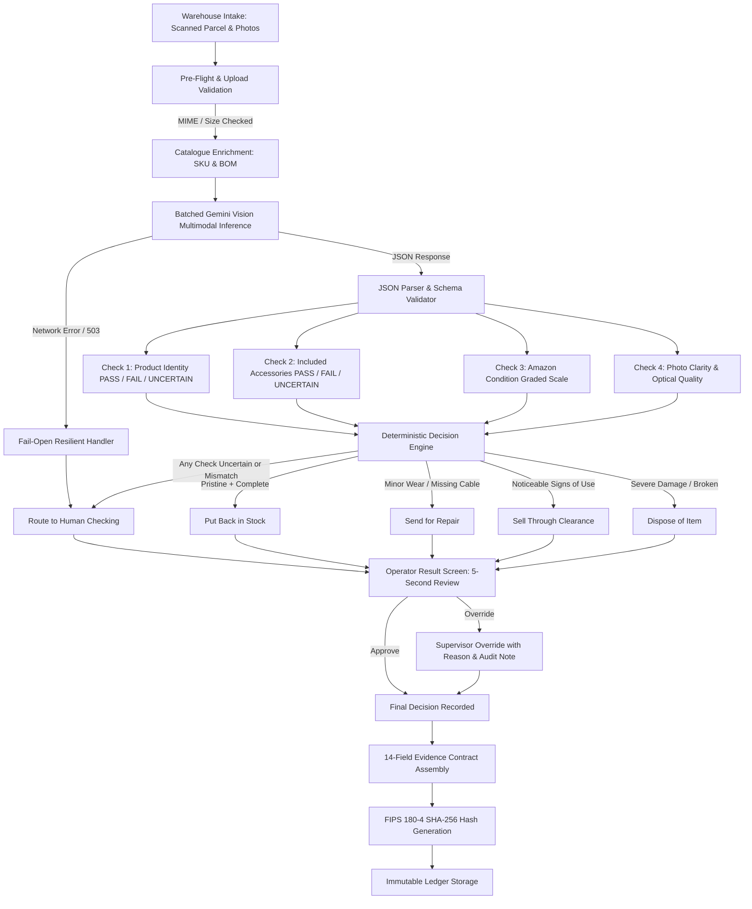

# Returns Manager Architecture

## 1. System Overview

**Returns Manager** is an automated returns inspection system designed for warehouse fulfillment operators. The system converts raw, unstructured parcel return photographs into verified, structured evidence, evaluates product completeness and physical condition against catalogue specifications, and derives operational routing recommendations using deterministic business rules.



---

## 2. Major Components

### 1. Frontend Client (`src/App.jsx`, `src/components/*`)
- **Inspection Station** (`InspectionUpload.jsx`, `ResultCard.jsx`): Allows operators to scan barcodes, look up orders, attach photos, and receive 5-second human-language recommendations.
- **Human Review / Attention Queue** (`App.jsx` `attention` tab): Surfaces items in the facility requiring manual confirmation due to blurry photos, lookalike models, or conflicting evidence.
- **Completed Returns Log** (`HistoryLog.jsx`): Responsive audit ledger that converts from a full table on desktop into touch-friendly stacked cards on mobile devices.
- **Human Override Dialog** (`OverrideModal.jsx`): Collects revised decisions and mandatory operational justifications, ensuring the original AI recommendation is preserved.
- **Cryptographic Contract Viewer** (`ContractModal.jsx`): Displays the 14-field JSON contract and verified SHA-256 hash.

### 2. AI Vision Inspector (`src/services/aiInspector.js`)
- Interfaces with the official `@google/generative-ai` SDK using `gemini-2.0-flash` (with automatic fallback to `gemini-1.5-flash`).
- Formulates a single batched multimodal prompt containing all inspection photos and the master catalogue Bill of Materials (BOM).
- Extracts structured visual evidence: product match status, parts present, parts missing, observed physical condition, and photo quality flags.
- Contains an offline vision fallback analyzer when no API key is present, ensuring reliable testing without network dependency.

### 3. Deterministic Decision Engine (`src/services/decisionEngine.js`)
- Decouples AI perception from business policy.
- Evaluates the four core inspection checks to determine the recommended action:
  - `restock` (Put back in stock)
  - `refurbish` (Send for repair)
  - `liquidate` (Sell through clearance)
  - `dispose` (Dispose of item)
  - `pending_review` (Needs human checking)
- Computes multi-factor **confidence gating** by taking the lowest meaningful confidence across core checks rather than masking uncertainty behind an average.

### 4. Human-Facing Translation Layer (`src/utils/userFacingText.js`)
- Formats all internal enum values and technical data into plain, professional warehouse language.
- Generates 1–2 sentence "Why?" explanations grounded in the evidence.
- Maps decimal confidence scores into a simple 3-tier traffic-light system: 🟢 **High**, 🟡 **Medium**, 🔴 **Low**.

### 5. Evidence Contract & Integrity Layer (`src/services/evidenceContract.js`)
- Assembles an immutable 14-field JSON contract matching the Buildathon Round 2 standard schema for downstream recovery systems.
- Computes cryptographic SHA-256 digests using a pure JavaScript FIPS 180-4 implementation.

### 6. Tenancy & Security Storage Layer (`src/services/authAndStorage.js`)
- Enforces query-level tenancy isolation between warehouse facilities (`org_demo_alpha` vs `org_demo_bravo`).
- Enforces upload security: MIME whitelist (`image/jpeg`, `image/png`, `image/webp`), 10MB file limit, and non-guessable tenant paths.
- Provides session authentication with 5-attempt rate-limiting lockout protection.

---

## 3. End-to-End Data Flow

```text
Operator scans parcel / selects SKU
        ↓
Catalogue specification & BOM retrieved from catalogue.js
        ↓
Operator attaches 1 to 4 photographs
        ↓
Files validated: MIME whitelist, 10MB limit, tenant image vault path generated
        ↓
Single batched Gemini Vision call (images + BOM specifications)
        ↓
AI returns structured JSON findings
        ↓
Parser validates schema; falls open to 'pending_review' if malformed
        ↓
Decision Engine derives disposition using deterministic business rules
        ↓
User-facing translation layer translates findings into natural language
        ↓
Operator reviews 5-second result screen
        ↓
Operator approves recommendation OR overrides with documented reason
        ↓
14-field evidence contract assembled and hashed with SHA-256
        ↓
Return record saved to immutable facility ledger
```

---

## 4. Model & AI Configuration

- **Primary Vision Model**: `gemini-2.0-flash`
- **Fallback Vision Model**: `gemini-1.5-flash`
- **SDK**: `@google/generative-ai` (v0.24.1)
- **Input Parameters**:
  - `temperature: 0.1` (low temperature to maximize deterministic factual consistency)
  - `responseMimeType: "application/json"`
- **Structured Output Schema**:
```json
{
  "identity": "PASS | FAIL | UNCERTAIN",
  "identity_basis": "string",
  "completeness": "PASS | FAIL | UNCERTAIN",
  "missing": ["string"],
  "observed_state": "factory_sealed | opened_unused | signs_of_use | damaged | empty_box | uncertain",
  "observed_state_basis": "string",
  "amazon_condition": "New | Used - Like New | Used - Very Good | Used - Good | Used - Acceptable | Unacceptable | Uncertain",
  "condition_basis": "string",
  "image_quality": {
    "blur_score": 0.0,
    "is_blurry": false,
    "glare_detected": false,
    "dark_lighting": false,
    "sufficient_for_verdict": true
  },
  "physical_observations": ["string"],
  "contradictions": ["string"]
}
```

---

## 5. Important Engineering Decisions

### 1. AI Vision for Observation, Deterministic Rules for Action
The model is never allowed to directly invent or determine the final business disposition. The vision model reports *what it physically sees* (identity, missing parts, wear, blur); application code evaluates those findings against established fulfillment rules. This eliminates unpredictable model hallucinations in financial/operational routing.

### 2. Multi-Photo Evidence Aggregation
The engine analyzes up to 4 photos per return. Accessories visible in Photo 2 but occluded in Photo 1 are correctly credited as present. An item is never assumed missing simply because it is absent in a single frame.

### 3. First-Class Uncertainty & Fail-Open Resilience
`UNCERTAIN` is treated as a valid, expected operational outcome. When optical conditions are inadequate (glare, blur, low contrast) or an item is visually identical to a clone, the system never guesses. The case is routed safely to `pending_review` ("Needs human checking").

### 4. Benchmark Isolation
The codebase cleanly separates demo/benchmark scenario metadata from the live inspection pipeline. Pre-computed scenario results exist solely for automated compliance testing; live inspections always process uploaded image bytes through the real visual inspection engine.

---

## 6. Failure Handling

| Failure Mode | Trigger | System Behavior |
| :--- | :--- | :--- |
| **API Timeout / Network Down** | Gemini API unavailable (HTTP 503 / timeout) | Fails open: sets disposition to `pending_review`, logs a network note, and preserves all user inputs without dropping the return. |
| **Malformed Model Output** | Vision model returns non-JSON or missing fields | JSON schema validator catches error and safely routes case to `pending_review`. |
| **Blurry or Dark Photography** | Optical quality check detects blur score < 0.50 or dark frame | Flags warning, provides plain-language upload advice, and routes to human checking. |
| **Contradictory Visual Evidence** | Packaging looks new, but unit exhibits surface scratches | Contradiction detector flags the conflict and routes case to supervisor review. |
| **Cross-Tenant Access Attempt** | Operator attempts to view unit from another facility | Query layer intercepts attempt, records a security audit event, and returns HTTP 403 `PERMISSION_DENIED`. |

---

## 7. Security Architecture

1. **Server-Side API Key Protection**: Private keys (`GEMINI_API_KEY`) remain strictly on the backend and are accessed exclusively through `/api/inspect`. No secret is shipped in client JavaScript bundles.
2. **Server-Side Rate Limiting**: The `/api/inspect` endpoint enforces in-memory rate limiting (max 20 requests per minute per tenant/IP) to prevent quota exhaustion and abuse.
3. **Server-Side Upload Validation**: File uploads are validated server-side for MIME type (`image/jpeg`, `image/png`, `image/webp`), size ceiling (10MB max), and structure before processing.
4. **Session Authentication & Rate Limiting**: Operators authenticate with facility-bound sessions. Consecutive failed login attempts trigger an exponential security lockout.
5. **Tenancy Isolation**: Multi-tenant boundaries are enforced at the query level. Staff at `org_demo_alpha` cannot query or view returns assigned to `org_demo_bravo`.
6. **Input Sanitization**: All user-controlled text inputs (order IDs, unit barcodes, override reasons) pass through HTML entity sanitizers before rendering to neutralize cross-site scripting (XSS).
7. **Cryptographic Integrity**: Evidence contracts use pure JavaScript FIPS 180-4 SHA-256 calculation to guarantee tamper detection across downstream systems.

---

## 8. Deployment Architecture

The application is deployed with a Vite frontend and serverless inspection endpoint (compatible with Vercel, Netlify, or Express):

```text
Browser Client (React SPA)
        ↓ POST /api/inspect (photos & order data)
Serverless Function / API Endpoint (api/inspect.js)
  [Rate Limiter: 20 req/min | Upload Validator: 10MB JPEG/PNG/WEBP | GEMINI_API_KEY]
        ↓
Google Gemini 2.0 Flash Vision API
        ↓ Extracted Evidence
Deterministic Business Rules Engine (evaluates disposition)
        ↓ Auditable Result Envelope (No secrets exposed)
Browser Client UI
```

- **Production Build**: Verified with `npm run build` using Vite 6.
- **Deployment Status**: Deployment ready.
- **Production Environment Variables**:
  - `GEMINI_API_KEY`: Server-only Google Gemini API Key.

