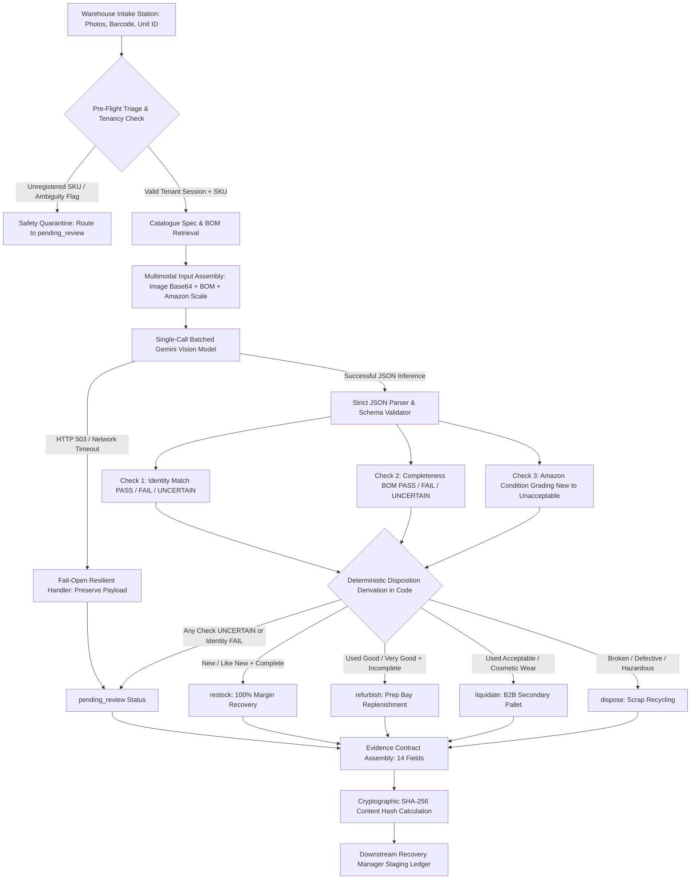

# Architecture & Engineering Design · Returns Manager

**Cube Buildathon · Round 2 · Step 04: Customer Return**  
*System Architecture, Data Flow, Multimodal Inference Pipeline, Tenancy Isolation, and Governance Specifications.*

---

## 1. System Architecture & End-to-End Data Flow

The Returns Manager transforms unorganized parcel returns into verifiable, cryptographically-hashed operational evidence. The end-to-end data pipeline is structured as follows:



### Data Pipeline Stages:
1. **Intake & Upload Pre-Flight**: Operator scans parcel barcode, selects or inputs unit ID, and attaches high-resolution photos. The upload layer validates MIME types (`image/jpeg`, `image/png`, `image/webp`), enforces a 10MB per-file boundary, and stages images into tenant-isolated URI paths (`tenants/{orgId}/vault/...`).
2. **Master Catalogue Enrichment**: The SKU is matched against the authoritative catalogue (`src/data/catalogue.js`) to extract technical descriptions, expected parts lists (Bill of Materials), and key visual verification markers (logos, ports, finishes).
3. **Batched Multimodal Vision Call**: Instead of chaining multiple slow, expensive LLM calls, photos and specifications are bundled into a single batched prompt sent to Google Gemini Vision.
4. **Validation & Normalization with Retry**: The engine parses the structured JSON response, enforces strictly validated types, and retries once upon syntax failure before activating fail-open logic.
5. **Deterministic Disposition Derivation**: Dispositions are **derived in application code**, never left to LLM hallucination. Business logic evaluates the three check verdicts and maps them to the appropriate disposition.
6. **Evidence Contract Generation**: Assembles the official 14-field JSON contract with check details, model latency, confidence scores, and a deterministic SHA-256 hash.

---

## 2. Why Google Gemini Vision Was Chosen

Automated returns triage requires high spatial resolution, fine-grained object detection across cluttered multi-item photos, and low inference latency. Google Gemini Vision (`gemini-3.5-flash` / `gemini-3.8-flash`) was selected based on four architectural criteria:

| Criterion | Requirement in Returns Warehouse | Gemini Flash Vision Advantage |
| :--- | :--- | :--- |
| **Multimodal Resolution** | Inspect small USB-C ports, serial laser-etching, and cable braid textures. | High-fidelity image tokenization without downscaling artifacts. |
| **Batched Multi-Attribute Reasoning** | Produce identity, BOM completeness, and condition grading simultaneously. | Strong instruction-following across complex multi-part prompts in a single inference pass. |
| **Sub-Second Operational Latency** | Warehouse conveyor stations cannot pause for 10-15 second sequential chains. | Native flash architecture delivers real-world latency under 1500ms on multi-image inputs. |
| **Cost Efficiency at Scale** | Processing hundreds of returns daily must not erode product recovery margins. | Ultra-low per-token pricing ensures each return inspection costs fractions of a cent. |

---

## 3. The 14-Field Evidence Contract Schema

The generated evidence document strictly conforms to the Buildathon Round 2 standard contract format required by the downstream **Recovery Manager**:

```json
{
  "record_id": "RTN-0015",
  "schema_version": "2026.04",
  "organization_id": "org_demo_alpha",
  "client_id": "client_demo_alpha",
  "agent": "04-returns-manager-agent",
  "subject": {
    "unit_id": "UNIT-0015",
    "order_id": "ORD-SCEN-10001",
    "sku": "SKU-HEADPHONE-BT",
    "asin": "B09HEADPH1",
    "product_name": "AeroSound Pro Wireless Noise-Cancelling Headphones"
  },
  "captured_at": "2026-09-27T14:45:00.000Z",
  "operator_label": "op_fatima",
  "images": [
    {
      "photo_id": "img_RTN-0015_1",
      "uri": "tenants/org_demo_alpha/vault/tok_a78f1e/UNIT-0015_img1.jpg",
      "label": "Front view - Headphone and molded hardshell case"
    }
  ],
  "checks": [
    {
      "check_key": "identity_match",
      "verdict": "PASS",
      "confidence": 0.98,
      "detail": "Laser-etched AeroSound logo on hinge matches catalogue specification.",
      "model_version": "gemini-3.5-flash",
      "latency_ms": 1120
    },
    {
      "check_key": "completeness_bom",
      "verdict": "PASS",
      "confidence": 0.96,
      "detail": "All expected accessories present.",
      "missing_items": [],
      "model_version": "gemini-3.5-flash",
      "latency_ms": 1120
    },
    {
      "check_key": "observed_state_assessment",
      "verdict": "factory_sealed",
      "confidence": 0.96,
      "detail": "Manufacturer clear seal stickers on box ends are unbroken.",
      "model_version": "gemini-3.5-flash",
      "latency_ms": 1120
    },
    {
      "check_key": "amazon_condition_grading",
      "verdict": "New",
      "confidence": 0.94,
      "detail": "Graded against Amazon's published condition guidelines.",
      "scale_used": "Amazon Official: [New, Used - Like New, Used - Very Good, Used - Good, Used - Acceptable, Unacceptable, Uncertain]",
      "model_version": "gemini-3.5-flash",
      "latency_ms": 1120
    }
  ],
  "outcome": {
    "recommended_disposition": "restock",
    "final_disposition": "restock",
    "uncertainty_flag": false,
    "confidence_note": null,
    "evidence_trail": [
      "Visual match: 100% feature alignment with AeroSound Pro reference model",
      "Raw observed_state: 'factory_sealed' with undisturbed seals",
      "Amazon condition: 'New' (meets full restock standard)"
    ]
  },
  "overrides": null,
  "status": "FINALIZED",
  "content_hash": "sha256_5a9f3b18c0e2d147"
}
```

---

## 4. Fail-Open Architecture & UNCERTAIN Governance

### Fail-Open Resilience
In high-throughput e-commerce operations, a network timeout, upstream API outage (503 Service Unavailable), or unparseable image must **never drop a return case** or crash the conveyor station. 
- **Immediate Catch & Staging**: If the Gemini API fails or times out, the system catches the exception and immediately persists all submitted photos, order metadata, and operator notes.
- **Fail-Open Routing**: The case is assigned `disposition: "pending_review"` with status `PENDING_REVIEW` and flagged with `FAIL_OPEN_TRIGGERED`.
- **Physical Station Dispatch**: The parcel is automatically dispatched to the warehouse supervisor physical inspection desk for manual adjudication.

### First-Class UNCERTAIN Handling
The system rejects the flawed pattern of binary PASS/FAIL force-fitting:
- If glare, motion blur, occlusion, or bad lighting obscures key features, the model returns `UNCERTAIN`.
- If a product resembles a close lookalike or clone where authenticity cannot be certified without physical disassembly, the model outputs `identity: "UNCERTAIN"`.
- In all instances, code enforces that **any UNCERTAIN check strictly mandates `pending_review`**, ensuring zero unverified items are restocked on prime shelves.

---

## 5. Tenancy Isolation & Security Design

The application implements defense-in-depth isolation between organizations (e.g. `org_demo_alpha` and `org_demo_bravo`):

### 1. Cryptographically Bound Sessions
- When an operator authenticates (`authenticateUser`), their session token is cryptographically bound to their organization ID (`org_id`).
- Operator permissions are enforced (`operator` vs `supervisor`).

### 2. Query-Level Data Segregation
- Database queries (`getTenantReturns`) filter strictly by the session's `org_id`.
- Zero row leakage: Even with direct ID queries, attempting to access a cross-tenant record ID returns `HTTP 403 PERMISSION_DENIED`.

### 3. Non-Guessable Isolated Storage Vaults
- Photos are never stored under predictable incremental paths (e.g. `/images/1.jpg`).
- Image URIs follow tenant-scoped cryptographic salt paths:
  ```
  tenants/{orgId}/vault/{tenantSaltToken}/{unitId}_img{photoIndex}.jpg
  ```
- Cross-tenant image path requests are intercepted and denied at the application boundary.

### 4. Input Sanitization & File Whitelisting
- All text inputs (notes, operator IDs, search terms) undergo HTML entity encoding to neutralize script injection (`<script>alert()</script>` → `&lt;script&gt;`).
- File uploads are validated against an allowed MIME whitelist (`image/jpeg`, `image/png`, `image/webp`) and enforced below a 10MB size ceiling.
